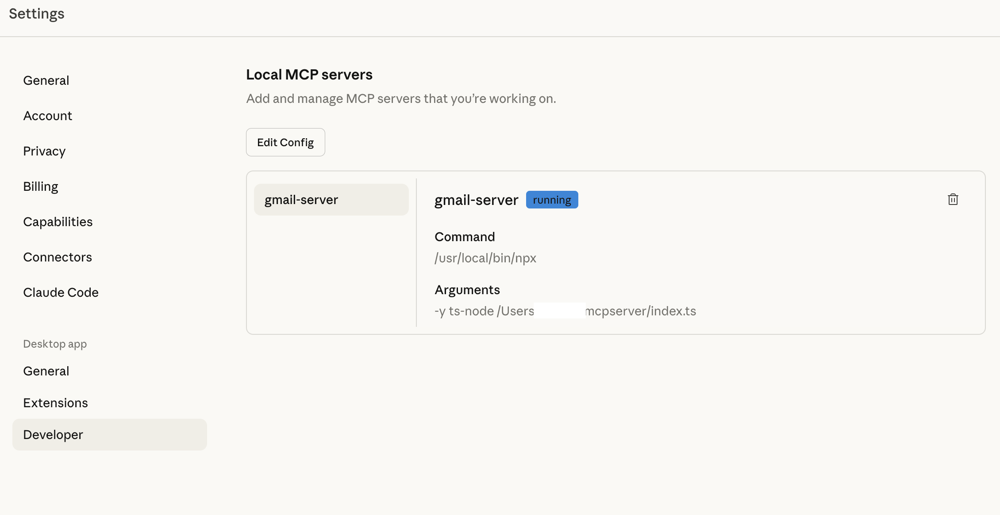
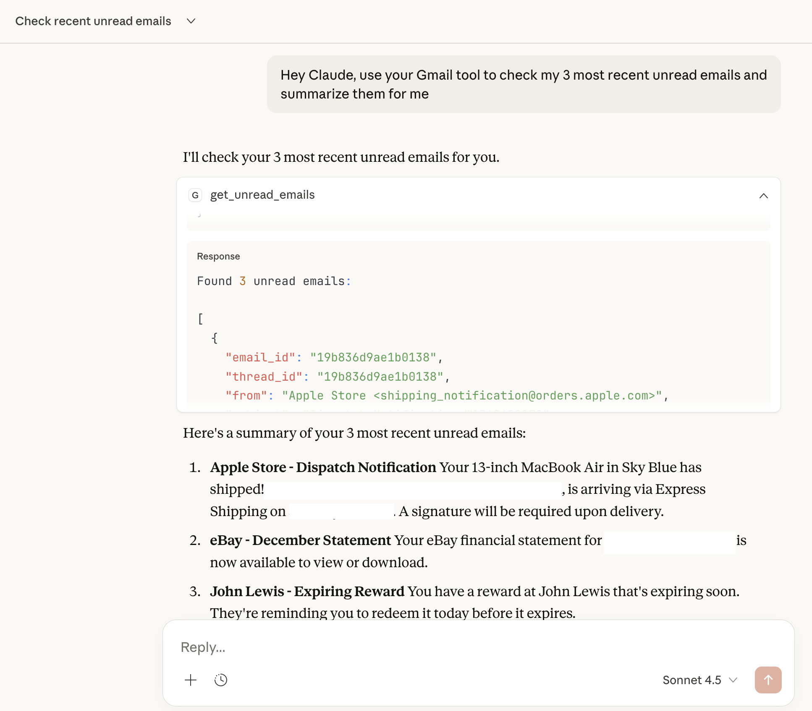
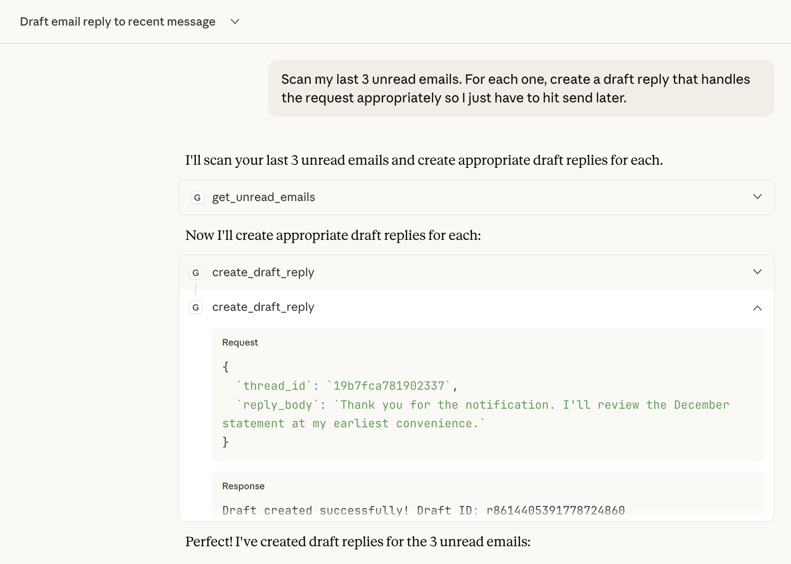

# Gmail MCP Server

A Model Context Protocol (MCP) server that connects Claude Desktop to your Gmail. This server allows an AI to intelligently manage your inbox by reading unread messages and preparing threaded draft replies.

## 📺 Working Demo

### 1. Connecting to the Server
Claude Desktop identifies the local MCP server and loads the custom Gmail tools.


### 2. Reading Unread Emails
Claude uses the `get_unread_emails` tool to fetch the latest messages, subjects, and thread IDs.


### 3. Creating a Draft Reply
Claude analyzes the context and calls `create_draft_reply` to generate a response.


### 4. Result in Gmail
The final result: a perfectly threaded draft waiting in your Gmail inbox.


---

## ⚙️ Configuration

To connect this server to Claude Desktop, you must document your local path in the configuration file.

**File Path:** * macOS: `~/Library/Application Support/Claude/claude_desktop_config.json`

**Your `claude_desktop_config.json` should look like this:**

```json
{
  "mcpServers": {
    "gmail-manager": {
      "command": "npx",
      "args": [
        "-y",
        "ts-node",
        "/Users/YOUR_USER/PATH_TO_FOLDER/index.ts"
      ],
      "env": {
        "PATH": "/usr/local/bin:/usr/bin:/bin:/usr/sbin:/sbin"
      }
    }
  }
}

## 🚀 Features

* **`get_unread_emails`**: Fetches a list of unread emails. Returns sender, subject, a snippet of the body, and the Thread ID.
* **`create_draft_reply`**: Creates a professional draft in your Gmail. It automatically handles threading headers (`In-Reply-To`, `References`) so the reply stays in the original conversation.
* **Secure OAuth2**: Uses official Google Cloud credentials and local token storage.

## 💬 Prompts to use

* *"Scan any unread emails. For each one, create a draft reply that handles the request appropriately so I just have to hit send later.*
* *"Hey Claude, use your Gmail tool to check my unread emails and summarize them for me."*

## 🛠 Prerequisites

* **Node.js**: v18.0.0 or higher.
* **Google Cloud Project**: A project with the Gmail API enabled and OAuth Desktop credentials.
* **MCP Client**: Claude Desktop or any other MCP-compatible host.

## 📥 Installation

1.  **Clone the Repository**
    ```bash
    git clone <your-repo-url>
    cd mcpserver
    npm install
    ```

2.  **Add Google Credentials**
    * Place your `credentials.json` (downloaded from Google Cloud Console) into the root of this folder.

3.  **Authenticate**
    * Run the authentication script:
        ```bash
        npx ts-node login.ts
        ```
    * Follow the URL in your browser, authorize the app, and when you reach the "localhost" error page, copy the `code=` value from the URL bar back into your terminal.

## ⚙️ Configuration

To use this with Claude Desktop, add the following to your `claude_desktop_config.json` (usually found at `~/Library/Application Support/Claude/claude_desktop_config.json`):

```json
{
  "mcpServers": {
    "gmail-server": {
      "command": "npx",
      "args": [
        "-y",
        "ts-node",
        "/Users/YOUR_USER/mcpserver/index.ts"
      ]
    }
  }
}
```

## 🔒 Security
This server is designed with privacy in mind:

* **Exclusion**: `credentials.json` and `token.json` are included in `.gitignore` to prevent accidental leaks.

* **Scoped Access**: The server only has `gmail.readonly` and `gmail.compose` scopes; it cannot delete your emails.

* **Local Processing**: Your email data is never stored on a 3rd party server; it moves directly between your local machine and the Gmail API.